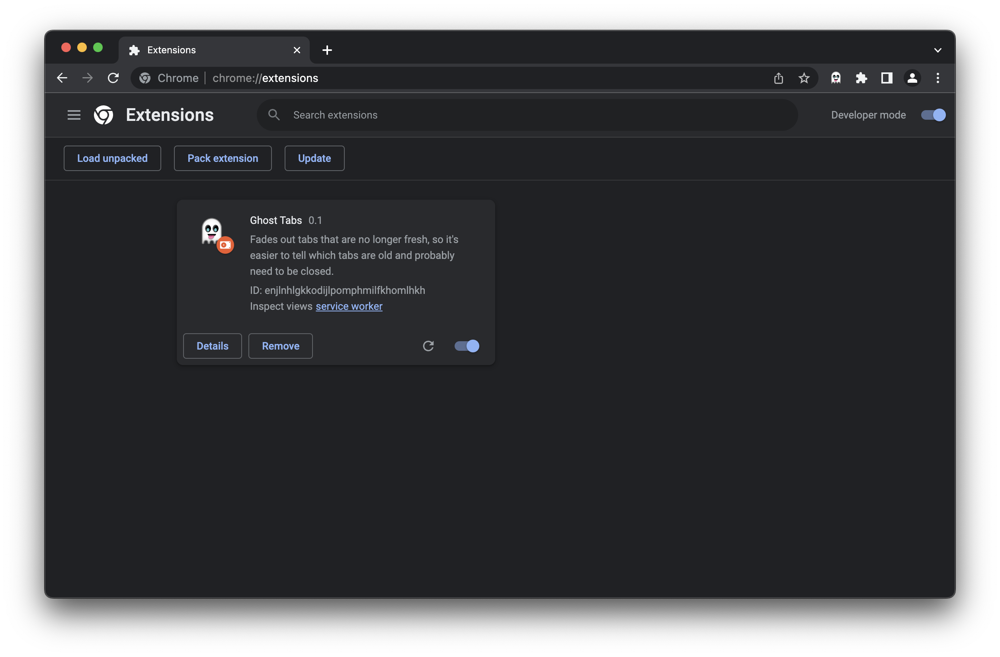
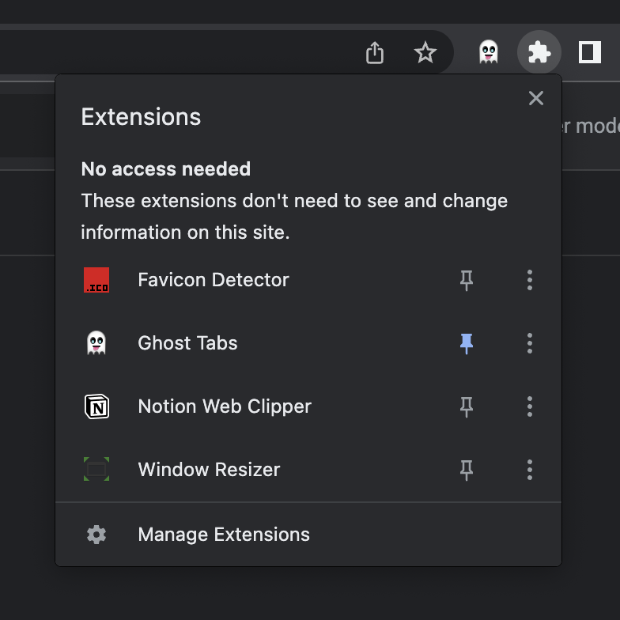
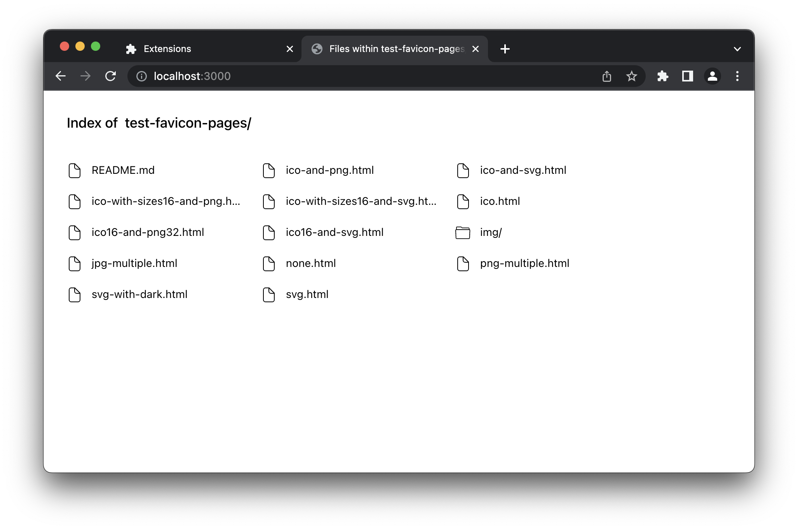
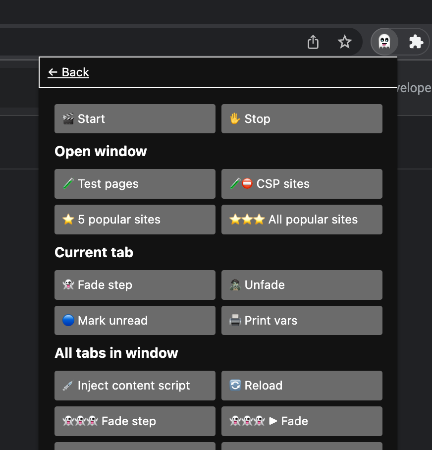

# Developing

I use FNM. This repo has it's required node version in `.node-version`. Pick up the version by running this.

```sh
fnm use
```

Install deps

```sh
pnpm install
```

## Development build

```sh
pnpm run watch
```

This creates a `build-watch` folder than you can then load into the Chrome extensions page: [chrome://extensions](chrome://extensions). Turn on development mode, and then click "Load unpacked".



Some things (like popups) get updated right away, but background scripts and content scripts require clicking the reload button (🔄).

Then, pin (📌) the extension for easier access.



### Test it with test pages

```sh
cd test-favicon-pages
```

And then follow instructions here: [readme](../test-favicon-pages/README.md).

You've got two ways to open up all the test pages:
1. Open the root page (likely, localhost:3000) and open each link in a new tab.
  
1. Open the popup by clicking the extension icon in the toolbar and press "k" to show the debug view, and then click the "Test pages" button under "Open window".
  

## Production build

```sh
pnpm run build
```